https://javabetter.cn/zhishixingqiu/paicoding.html

https://paicoding.com/


一个基于 Spring Boot、MyBatis-Plus、MySQL、Redis、ElasticSearch、MongoDB、Docker、RabbitMQ 等技术栈实现的社区系统。

采用主流的互联网技术架构、全新的 UI 设计、支持一键源码部署，拥有完整的文章&教程发布/搜索/评论/统计流程等。

## 概述

### 技术栈

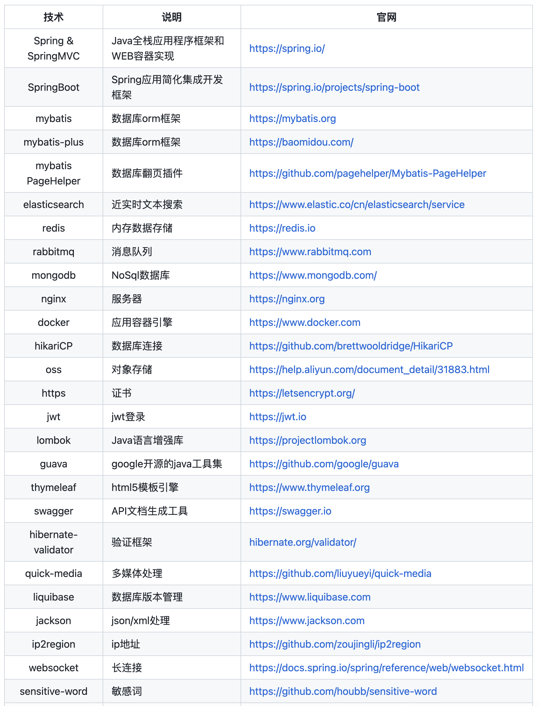

- 构建工具：后端（Maven、Gradle）、前端（Webpack、Vite）
- 单元测试：Junit
- 开发框架：SpringMVC、Spring、Spring Boot
- Web 服务器：Tomcat、Caddy、Nginx
- 微服务：Spring Cloud
- 数据层：JPA、MyBatis、MyBatis-Plus
- 模板引擎：thymeleaf
- 容器：Docker（镜像仓库服务 Harbor、图形化工具 Portainer）、k8s、Podman
- 分布式 RPC 框架：Dubbo
- 消息队列：Kafka（图形化工具 Eagle）、RocketMQ、RabbitMQ、Pulsar
- 持续集成：Jenkins、Drone
- 压力测试：Jmeter
- 数据库：MySQL（数据库中间件 Gaea、同步数据 canal、数据库迁移工具 Flyway）
- 缓存：Redis（增强模块 RedisMod、ORM 框架 RedisOM）
- nosql：MongoDB
- 对象存储服务：minio
- 日志：Log4j、Logback、SF4J、Log4j2
- 搜索引擎：ES
- 日志收集：ELK（日志采集器 Filebeat）、EFK（Fluentd）、LPG（Loki+Promtail+Grafana）
- 大数据：Spark、Hadoop、HBase、Hive、Storm、Flink
- 分布式应用程序协调：Zookeeper
- token 管理：jwt（nimbus-jose-jwt）
- 诊断工具：arthas
- 安全框架：Shiro、SpringSecurity
- 权限框架：Keycloak、Sa-Token
- JSON 处理：fastjson2、Jackson、Gson
- office 文档操作：EasyPoi、EasyExcel
- 文件预览：kkFileView
- 属性映射：mapStruct
- Java 硬件信息库：oshi
- Java 连接 SSH 服务器：ganymed
- 接口文档：Swagger-ui、Knife4j、Spring Doc、Torna、YApi
- 任务调度框架：Spring Task、Quartz、PowerJob、XXL-Job
- Git 服务：Gogs
- 低代码：LowCodeEngine、Yao、Erupt、magic-api
- API 网关：Gateway、Zuul、apisix
- 数据可视化（Business Intelligence，也就是 BI）：DataEase、Metabase
- 项目文档：Hexo、VuePress
- 应用监控：SpringBoot Admin、Grafana、SkyWalking、Elastic APM
- 注解：lombok
- jdbc 连接池：Druid
- Java 工具包：hutool、Guava
- 数据检查：hibernate validator
- 代码生成器：Mybatis generator
- Web 自动化测试：selenium
- HTTP 客户端工具：Retrofit
- 脚手架：sa-plus

### 架构图

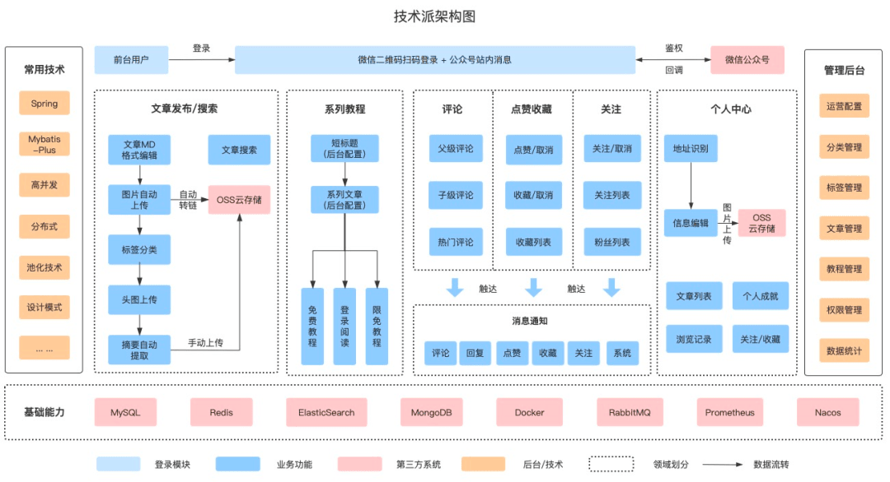


#### 1 整体设计草图

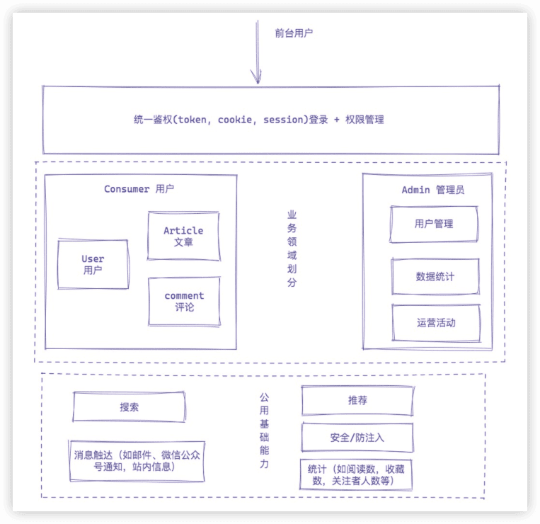


### 学到什么

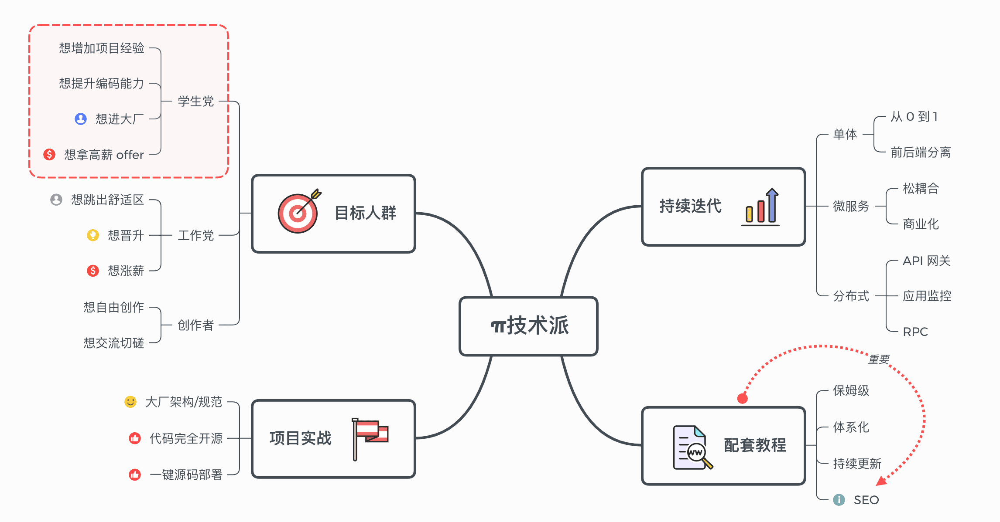


### Git分支

采用GitHub Flow模式

```
main (唯一长期分支)
  ↑
  ├── feature/login-page (功能分支)
  ├── feature/payment-api
  ├── bugfix/fix-null-pointer
  └── hotfix/security-patch
```

核心规则：

1. main 分支永远保持可部署状态
2. 所有开发在 feature 分支进行
3. 通过 PR/MR 合并到 main
4. 合并后立即部署

分支命名：

```bash
# 功能开发
feature/user-registration
feature/shopping-cart
feature/20260327-search-api  # 加日期更清晰

# Bug 修复
bugfix/fix-login-timeout
bugfix/issue-123  # 关联 Issue 编号

# 紧急修复
hotfix/security-vulnerability
hotfix/production-crash

# 实验性功能
experiment/ai-recommend
poc/blockchain-integration
```


## 如何学习枢社区

[技术派最佳学习实践视频](https://meeting.tencent.com/meeting-record/shares?id=230b4a21-b611-46f5-8cf2-96e2043ea5bd&from=3)

环境先跑起来

挑选你最感兴趣的一个模块，比如评论模块，然后看这个模块的功能是如何实现的。

看代码的过程中，可以抛开一些复杂的语法，只看 CURD 的逻辑，从 Controller 入口，一直 Debug 到存储层，只要你会 Java，这个就很简单。


# 大厂篇

## 架构方案设计


通常对于技术人员而言，在开启一个新的项目之前，做了前期的调研、立项之后，第一件事情并不是开始搭建工程、撸代码；一个整体的架构方案设计、评审都属于不可忽视的环节。  

### 业务模块拆解  

除了业务属性维度之外，还有一个非常重要的属性是参与者角色  

#### 角色拆解  

作为一个社区系统，用户角色非常容易划分  

- 读者：普通浏览文章的用户 
- 作者：发布文章的用户 
- 管理员：整个系统的超管  

**权限划分**，这三个角色的**权柄**划分： 

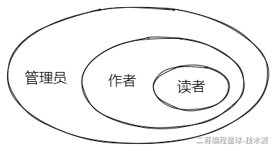  

从上图可以比较清晰的看出三个角色的划分 

- 读者的所有功能，作者都拥有；但是作者存在部分读者用不了的功能（如文章编辑、修改、发布等）
- 管理员权限最大，覆盖读者、作者的所有功能点  

**差异性划分**  

三个角色的主要差异

- 读者：主要是阅读文章
- 作者：发布文章，作为信息输出
- 管理员：整个系统的运营管理，如标签、分类管理，文章审核等；通常不怎么参与文章的阅读发布  

基于以上分析，可以将枢社区的用户分为

- 普通用户：作为社区的注册用户，围绕文章主体展开其覆盖的业务功能点
- 管理员：作为官方角色，主要负责整个社区的生态运营  


#### 业务拆解

整个社区系统，按找业务边界先进行一版本初始划分：

- 用户
- 文章
- 评论
- 专栏
- 消息通知

然后再针对上面的进行简单的细化拆分  

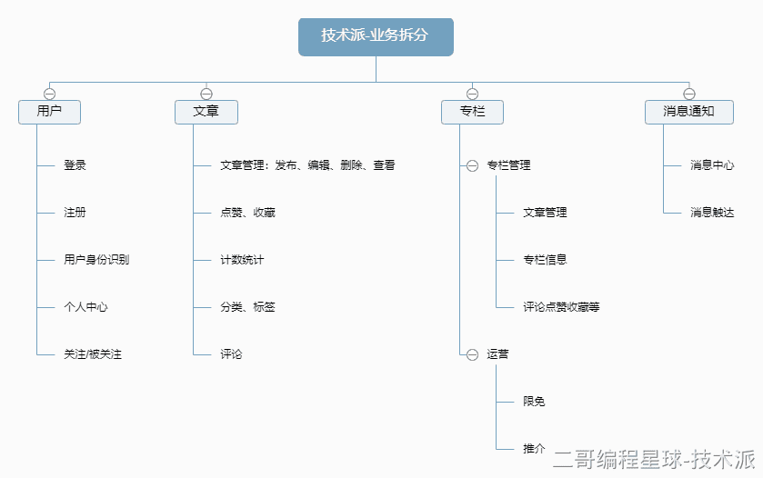 


再上面进行简单拆分之后，会发现几个关键点

- 专栏：实际上是一些文章的合集，因此专栏的很多功能点可以直接建立在文章的基础上
- 评论：评论实际上也是依托于文章的点评，因此它于文章的关联性很强
- 消息通知：
  - 消息通知的触发点需要进一步确认，但是它本身又属于一个相对独立的业务板块，因此重点关注交互方式
  - 什么样的需要通知？如何触发通知？
  - 怎么通知给用户？
- 点赞、收藏、计数统计
  - 这种与业务相关，但是又可以抽离于业务之外独立存在，可以考虑建设通用的服务能力 

独立于核心业务功能之外的能力：

- 社区的搜索、推荐，虽然不影响核心业务功能，但是否需要考虑？
- 社区运营   

基于以上，我们进行业务模块拆分，先确定以下板块

 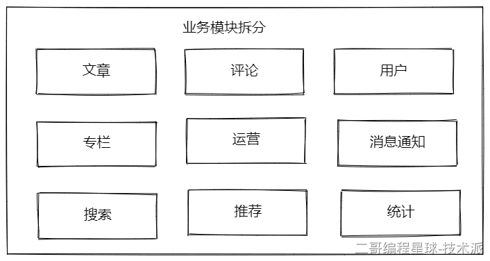 


小结  

通常，在业务拆解这里，希望达到的目的是让参与者，能知晓这个项目的整体情况，可以划分为多少业务域，明确业务模块的主营范畴，确定彼此的边界  

在这一阶段，我们可以先对枢社区的整体拆分，得出以下结论：  

**角色**  

+ 普通用户：作为社区的注册用户，围绕文章主体展开其覆盖的业务功能点 
+ 管理员：作为官方角色，主要负责整个社区的生态运营  

**业务模块** 

+ 业务侧：     
  + 文章    - 评论    - 专栏    - 用户    - 运营 
+ 基础功能测：     
  + 推荐    - 搜索    - 统计    - 消息通知 

**注意** 

+ 一般来说，在整体设计阶段，每个业务模块，需明确的是主体业务功能，但并不需要拆解到一个一个具体的功能点，具体的功能点，放在详细设计中来体现

+ 业务的拆解不是一蹴而就的，相反实际情况下，这个拆解经常会出现反复、变动的情况（如果有留心公司的组织结构调整的小伙伴，应该对这种情况不难理解）  

  

### 模块交互方案

将上面拆分的角色和业务模块串联起来

#### 整体交互设计 

对于枢社区的核心玩法，在于作者发布文章，读者阅读文章；整体交互相对清晰简单，实际上这一块是可以省略的；当然我这里也补上这个流程，主要以文章发布，到读者阅读文章，并点赞，作者获取通知这个流程，来串一下这个系统的整体交互流程  

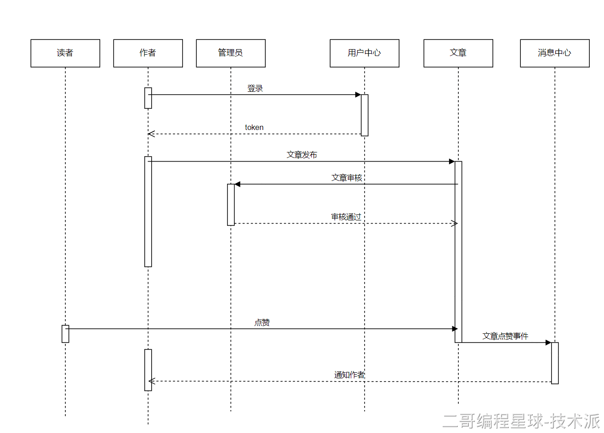  

上面这个交互过程中，用户中心、文章、消息中心，可以是独立部署的服务，也可以是一个进程内的服务；但是从逻辑上，他们彼此是独立的；针对上面的操作流程，可以提炼下面几个点  

+ 用户首先通过用户中心登录系统     
  + 具体的登录方式可以是传统的用户名/密码，也可以是手机号验证码，亦或者是第三方OAuth2.0登录
  + 登录之后，用户身份识别，可以是单机的cookie/session, 也可以是分布式会话，jwt等形式
+ 文章发布
  + 正向逻辑为作者发布文章
  + 文章审核对于作者而言，则属于被动接收，即存在一个依赖关系，是自动审核，还是人工审核？ 人工审核怎么通知管理员来审核？
+ 消息通知
  + 读者给文章点赞之后，如何将点赞通知给作者？
  + 这个点赞事件是同步触发给作者，还是异步？  

#### 登录交互方案  

登录交互我们最终选择的方案是基于微信公众号来实现的，下面这个交互方案适用于个人公众号（如果是企业公众号，可以直接使用微信的相关的API）

 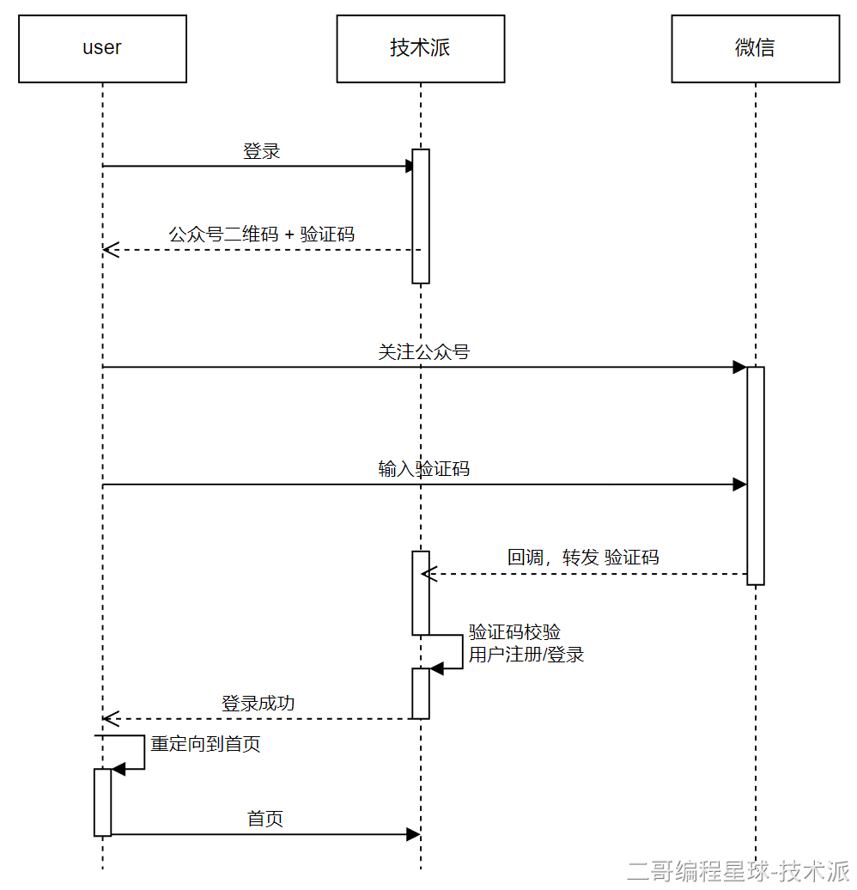  

#### 消息通知方案  

消息通知采用异步驱动，通过Event/Listener方式来实现解耦 

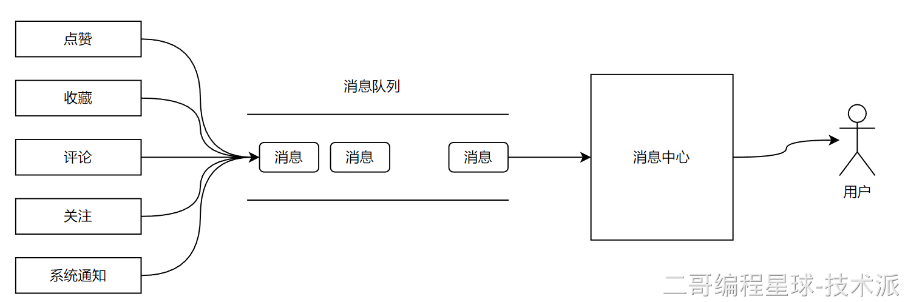  


### 整体架构方案  

上面的流程走完之后，接下来就是敲定整体的架构方案，通常一个好的架构方案一张图就完事了，注意越是前期在意的越不是细节  

#### 初版设计方案  

> 下面这张图来自于枢社区开始做之前绘制的，与最终的实现版稍有差异，无需在意细节🤭 


 最初版的方案设计非常简陋，当然思路还是比较清晰的  从上面这个图，是否能抓住整个枢社区的业务模块？是否能确定业务模块的定位（哪些偏业务属性，哪些偏技术属性）？ 是否能确定不同角色的侧重点？  能满足上面三个点，和其他人进行沟通时，不会产生歧义即可；当然上面这个图是缺少交互方案的，通常在业务架构图中，不太会整这个，有放在细节里进行铺开，也有放在详细设计中的  

#### 业务架构图  

接下来看一下枢社区最终定稿的整体业务架构图，如下：    

再看一下前后台的业务拆分  

  

最后再看一下枢社区的技术架构图

  

  ### 小结

注意这一篇不算是正规的技术架构方案说明书，更多的是将整个方案的落地过程给大家刨析了一遍，算是抛砖引玉，希望可以给大家今后写架构方案提供一点帮助  

先总结的方案设计思路如下： 

 


## 技术方案设计

### 系统模块介绍


#### 展示层

- 面向普通用户的前台
- 面向管理员的后台。前端基于react

#### 应用层

也可以称为业务层，强业务相关

- 文章
- 专栏
- 评论
- 用户
- 收藏
- 订阅
- 运营
- 审核
- 类目标签
- 统计

#### 服务层

将一些通用的、可抽离业务属性的功能模块，沉淀到服务层，作为一个一个的基础服务进行设计，比如计数服务、消息服务等，通常他们最大特点就是独立与业务之外，适用性更广，并不局限在特定的业务领域内，可以作为通用的技术方案存在。

- 用户权限管理（auth）


#### 平台资源层


### 系统模块设计

#### 用户模块

- 注册登录
- 权限管理
- 业务逻辑


#### 文章模块


#### 评论模块


#### 消息模块


#### 通用模块


## 枢社区项目管理流程

### 标准项目管理流程

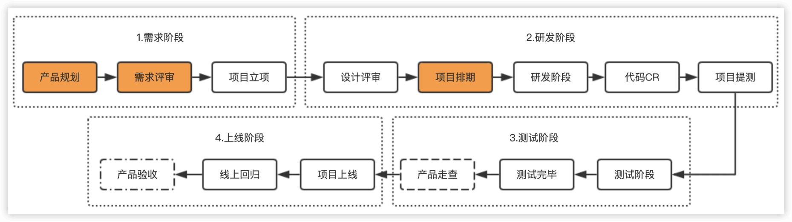

#### 需求阶段


完整的需求文档


#### 研发阶段


#### 测试&上线阶段


### 枢社区项目管理流程


## 枢社区产品调研

类似掘金的内容平台

Axure RP

飞书

## 枢社区产品设计

figma


## 交互视觉设计

logo设计


## 代码约束规范


# 基础篇

## 项目工程搭建手册


### 项目本地编译运行

首次启动会自动创建数据库表，并初始化一些用户、博文等相关数据；


## API文档之Knife4j

http://localhost:8080/doc.html

Knife4j相对于swagger的升级：

- 不仅在界面上更加优雅、炫酷，功能上也更加强大：后端 Java 代码和前端 UI 模块分离了出来，在微服务场景下更加灵活；还提供了专注于 Swagger 的增强解决方案。
- 在 API 文档中使用 Markdown 语法，可以使文档更具可读性和易于维护。
- 将 API 文档导出为离线的 HTML、PDF 或 Markdown 文件，方便分享。
- 支持在不同的环境（如开发、测试、生产等）中使用不同的 API 文档配置。
- 支持动态参数，允许用户在运行时修改 API 请求的参数，提高测试的灵活性。


## MVC分成架构


### 三层架构与MVC的区别

MVC：

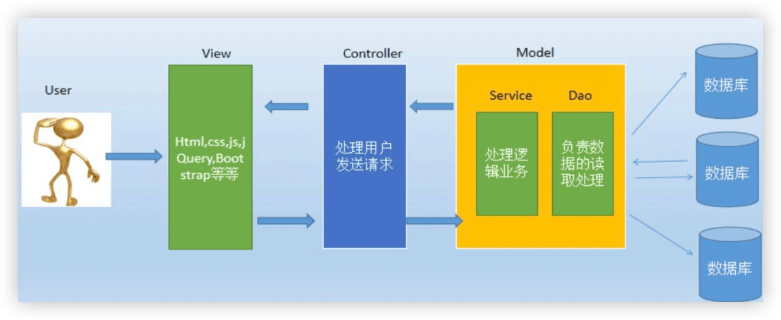


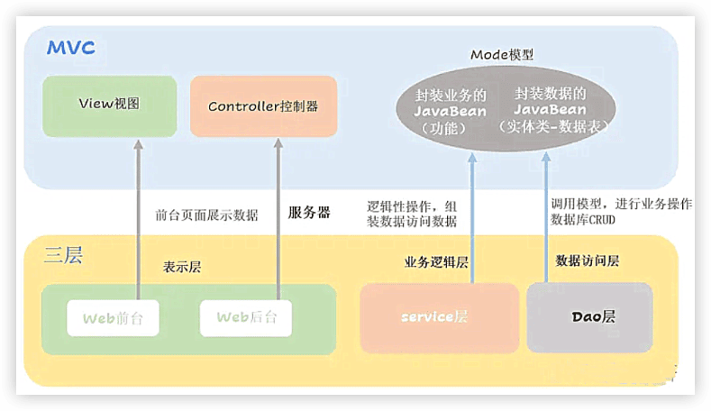

两者不是同一维度的东西：

- **三层架构**：是**后端代码的分层规范**（纯后端）
- **MVC**：是**前端 + 后端交互的设计模式**（前后端一起）

简单说：

- **MVC 的 Controller = 三层架构的表现层**
- **MVC 的 Model = 三层架构的 Service + Dao**


```
paicoding-api
paicoding-core
paicoding-service  // 后端核心逻辑
		service/article/service  业务逻辑层，对DAO层的封装
		service/article/repository  数据访问层（DAL）也叫DAO层，负责与DB的交互
paicoding-ui			// view层，PC 界面
paicoding-web			// Controller层，界面与后端交互逻辑
		admin			后台后端
		其余   		 PC端的后端接口
```


## 实体对象DO、DTO、VO

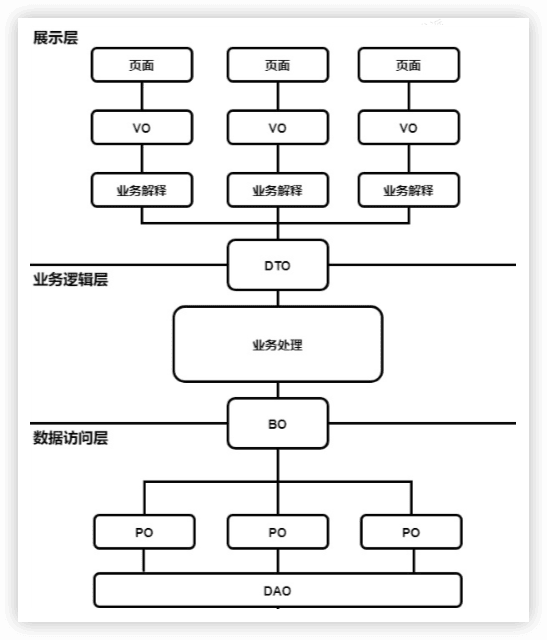

在java的生态体系中实体类有各种命名习惯，比如do,dto,bo,vo,po,entity,rsp,req等

### 概念

#### do 领域对象

domain object: 从现实世界中抽象出来的有形或无形的业务实体

#### dto 数据传输对象

data transfer object:  数据传输对象，来的目的是为了EJB的分布式应用提供粗粒度的数据实体，以减少分布式调用的次数，从而提高分布式调用的性能和降低网络负载

通常适用于展示层与服务层之间、服务层与服务层之间的数据传输对象

#### bo 业务对象

Business Object：业务对象，通常是服务内的业务相关属性对象

#### po 持久化对象

Persistant Object：持久化对象，通常对应数据库中的实体

另一个常见的命名规范为 Entity

#### vo 视图对象

view object: 视图对象，通常可以理解为展示的对象，展示的对象可以是网页、客户端、app

#### req 请求参数对象

request: 请求参数封装对象类，通常专制接口的传参对t象

#### rsp 返回结果对象

response: 返回结果封装类，通常用于将返回给展示层的对象格式化统一返回的场景


### 枢社区的实体类

再枢社区中，并没有把上面所有的都引进来，主要可以看到

- do: 数据库实体 （这个其实叫做po或entity更合适，我们这里直接干掉了po/entity，减少转换，适用于小型的项目，大型、分布式项目不要这么干）
- dto: 返回给前端的数据实体
- vo: 封装返回给前端的数据实体
- req：前端传递给后端的请求参数


## 技术派AOP实现切面日志 🔖

术派中关于 AOP 切面的应用目前有两处，一处是 MdcAspect 用于方法执行耗时统计，另外一处是 DsAspect 用于动态切换数据源。

**AOP = 不修改源码 + 统一增强方法**

核心：**切面（功能）、切点（匹配哪些方法）、通知（什么时候执行）**

底层：**动态代理**（JDK 代理 / CGLIB 代理）

### AOP相关术语

1. 横切关注点，


### 最常用的AOP场景

1. **接口日志**（最常用）
2. **声明式事务**（`@Transactional` 底层就是 AOP）
3. **权限校验**
4. **接口限流 / 防重复提交**
5. **方法耗时统计**
6. **缓存**

### 实操AOP记录接口访问日志

#### SkyWalkingTraceIdGenerator


## 枢社区整合MyBatis-Plus

```java
@Configuration
@ComponentScan("com.github.paicoding.forum.service")
@MapperScan(basePackages = {
        "com.github.paicoding.forum.service.article.repository.mapper",
        "com.github.paicoding.forum.service.user.repository.mapper",
        "com.github.paicoding.forum.service.comment.repository.mapper",
        "com.github.paicoding.forum.service.config.repository.mapper",
        "com.github.paicoding.forum.service.statistics.repository.mapper",
        "com.github.paicoding.forum.service.notify.repository.mapper",
        "com.github.paicoding.forum.service.shortlink.repository.mapper",
})
public class ServiceAutoConfig {
}
```


### @ComponentScan与@MapperScan


#### 1. **@ComponentScan 扫描结果**

会扫描 `com.github.paicoding.forum.service` 包下所有带有以下注解的类，并**生成对应的 Spring Bean**：

- **@Service**: 业务逻辑层服务类
  - 例如：`ArticleService`, `UserService`, `CommentService` 等
  
- **@Component**: 通用组件类
  - 例如：工具类、辅助类等
  
- **@Repository**: 数据访问层（虽然主要用 Mapper，但可能有自定义 Repository）

- **@Controller / @RestController**: 控制器（如果有的话）

**生成的 Bean 数量**：取决于该包下有多少个带上述注解的类，通常会有几十个 Service Bean。

#### 2. **@MapperScan 扫描结果**

会扫描指定 7 个包下的所有 **Mapper 接口**，并为每个接口**生成代理 Bean**：

```
扫描的包                          | 生成的 Bean 类型
----------------------------------|------------------
article.repository.mapper         | ArticleMapper, ArticleContentMapper 等
user.repository.mapper            | UserMapper, UserInfoMapper 等  
comment.repository.mapper         | CommentMapper 等
config.repository.mapper          | ConfigMapper 等
statistics.repository.mapper      | 统计相关 Mapper
notify.repository.mapper          | 通知相关 Mapper
shortlink.repository.mapper       | 短链接相关 Mapper
```


**生成的 Bean 特点**：
- 这些是 **MyBatis-Plus 的动态代理对象**
- Bean 名称默认是接口名首字母小写（如 `articleMapper`）
- 可以直接通过 `@Autowired` 注入使用

#### 实际示例

假设项目中有这样的结构：

```java
// Service 类 - 被 @ComponentScan 发现
@Service
public class ArticleService {
    @Autowired
    private ArticleMapper articleMapper;  // 注入 Mapper Bean
}

// Mapper 接口 - 被 @MapperScan 发现
public interface ArticleMapper extends BaseMapper<Article> {
    // MyBatis-Plus 会自动实现这个方法
}
```


**Spring 容器中会生成**：
1. ✅ `articleService` Bean（单例）
2. ✅ `articleMapper` Bean（动态代理对象，单例）

#### 验证方式

你可以通过以下方式查看实际生成的 Bean：

```java
// 在任何 Spring Bean 中注入 ApplicationContext
@Autowired
private ApplicationContext context;

// 查看所有 Bean
String[] beanNames = context.getBeanDefinitionNames();
for (String name : beanNames) {
    System.out.println(name);
}

// 或者查看特定类型的 Bean
Map<String, ArticleService> services = context.getBeansOfType(ArticleService.class);
Map<String, ArticleMapper> mappers = context.getBeansOfType(ArticleMapper.class);
```

#### 总结

| 注解           | 扫描目标                             | 是否生成 Bean | Bean 类型             |
| -------------- | ------------------------------------ | ------------- | --------------------- |
| @ComponentScan | @Service/@Component/@Repository 等类 | ✅ 是          | 普通 Spring Bean      |
| @MapperScan    | Mapper 接口                          | ✅ 是          | MyBatis 动态代理 Bean |

**关键点**：
- 这两个注解配合使用，完成了 **Service 层 + DAO 层** 的完整 Bean 注册
- 上层模块只需引入这个配置类，就能自动获得所有业务能力和数据访问能力
- 这是典型的 **模块化自动装配** 设计模式


### MyBatis-Plus Mapper 动态代理原理

#### 1. **核心架构**

```
ArticleMapper (接口)
    ↓ @MapperScan 扫描
MapperFactoryBean (工厂Bean)
    ↓ 创建代理对象
JDK 动态代理 / CGLIB
    ↓ 拦截方法调用
MyBatis MapperProxy
    ↓ 执行 SQL
SqlSession → Executor → StatementHandler
    ↓
数据库
```


---

#### 2. **关键组件解析**

**(1) BaseMapper<T> 继承链**

```java
public interface ArticleMapper extends BaseMapper<ArticleDO> {
    // 继承了 BaseMapper 的所有 CRUD 方法
    // 如: selectById, insert, updateById, deleteById 等
}
```


`BaseMapper<T>` 提供了 **17+ 个通用 CRUD 方法**，这些方法都有对应的 XML SQL 映射。

---

**(2) @MapperScan 的作用**

当 Spring 启动时：

```java
@MapperScan(basePackages = {...})
```


会执行以下流程：

```java
// 1. 注册 MapperScannerConfigurer
MapperScannerConfigurer scanner = new MapperScannerConfigurer();
scanner.setBasePackage("com.github.paicoding.forum.service.article.repository.mapper");

// 2. 扫描包下的所有接口
// 3. 为每个接口注册 MapperFactoryBean
// 4. MapperFactoryBean 负责创建代理对象
```


---

**(3) MapperFactoryBean 创建代理**

```java
public class MapperFactoryBean<T> extends SqlSessionDaoSupport implements FactoryBean<T> {
    
    @Override
    public T getObject() throws Exception {
        // 获取 SqlSessionTemplate
        SqlSessionTemplate sqlSession = getSqlSessionTemplate();
        
        // 创建动态代理对象
        return sqlSession.getMapper(mapperInterface);
    }
}
```


**关键点**：
- `MapperFactoryBean` 实现了 `FactoryBean<T>` 接口
- Spring 容器获取 Bean 时，实际调用的是 `getObject()` 方法
- 返回的是**代理对象**，不是接口本身

**(4) JDK 动态代理实现**

MyBatis 使用 **JDK 动态代理**（因为 Mapper 是接口）：

```java
public class MapperProxy<T> implements InvocationHandler, Serializable {
    
    private final SqlSession sqlSession;
    private final Class<T> mapperInterface;
    private final Map<Method, MapperMethodInvoker> methodCache;
    
    @Override
    public Object invoke(Object proxy, Method method, Object[] args) throws Throwable {
        // 1. 判断是否是 Object 类的方法（toString、hashCode 等）
        if (Object.class.equals(method.getDeclaringClass())) {
            return method.invoke(this, args);
        }
        
        // 2. 缓存优化：检查是否已经解析过该方法
        MapperMethodInvoker invoker = methodCache.get(method);
        if (invoker == null) {
            invoker = new PlainMethodInvoker(
                new MapperMethod(mapperInterface, method, sqlSession.getConfiguration())
            );
            methodCache.put(method, invoker);
        }
        
        // 3. 执行 SQL
        return invoker.invoke(sqlSession, args);
    }
}
```


---

#### 3. **方法调用完整流程**

以 `articleMapper.selectById(1L)` 为例：

```
1. 调用代理对象方法
   articleMapper.selectById(1L)
   
2. 触发 InvocationHandler.invoke()
   MapperProxy.invoke(proxy, selectById方法, [1L])
   
3. 创建/获取 MapperMethod
   - 解析方法签名
   - 查找对应的 MappedStatement（SQL 定义）
   - 从 BaseMapper.xml 中找到 selectById 的 SQL
   
4. 执行 SQL
   MapperMethod.execute(sqlSession, args)
   ↓
   sqlSession.selectOne("com.github...ArticleMapper.selectById", 1L)
   
5. 通过 Executor 执行
   Executor.query(mappedStatement, parameter, rowBounds, resultHandler)
   
6. 处理结果集
   ResultSetHandler.handleResultSets(statement)
   ↓
   将 ResultSet 转换为 ArticleDO 对象
   
7. 返回结果
   返回 ArticleDO 实例
```


---

#### 4. **自定义方法的 SQL 映射**

对于 `ArticleMapper` 中自定义的方法，需要对应的 XML 配置：

```xml
<!-- ArticleMapper.xml -->
<mapper namespace="com.github.paicoding.forum.service.article.repository.mapper.ArticleMapper">
    
    <!-- 对应 listArticlesOrderById 方法 -->
    <select id="listArticlesOrderById" resultType="SimpleArticleDTO">
        SELECT id, title, user_id, create_time 
        FROM article 
        WHERE id > #{lastId} 
        ORDER BY id ASC 
        LIMIT #{size}
    </select>
    
    <!-- 对应 listArticlesByReadCounts 方法 -->
    <select id="listArticlesByReadCounts" resultType="SimpleArticleDTO">
        SELECT a.id, a.title, a.user_id, s.read_count
        FROM article a
        LEFT JOIN article_statistic s ON a.id = s.article_id
        ORDER BY s.read_count DESC
        LIMIT #{pageParam.pageSize} OFFSET #{pageParam.offset}
    </select>
    
</mapper>
```


**映射规则**：
- `namespace` 必须是 Mapper 接口的全限定名
- `id` 必须与方法名完全一致
- 参数通过 `#{}` 占位符绑定
- 结果自动映射到 `resultType` 指定的类型

---

#### 5. **Spring 容器中的 Bean 管理**

```java
// Spring 启动时的注册过程
@Configuration
@MapperScan("com.github.paicoding.forum.service.article.repository.mapper")
public class ServiceAutoConfig {
    // Spring 会自动为 ArticleMapper 注册一个 Bean
    // Bean 名称: "articleMapper"（首字母小写）
    // Bean 类型: ArticleMapper 的代理对象
}

// 使用时直接注入
@Service
public class ArticleService {
    @Autowired
    private ArticleMapper articleMapper;  // 注入的是代理对象
    
    public ArticleDO getArticle(Long id) {
        return articleMapper.selectById(id);  // 调用代理方法
    }
}
```


---

#### 6. **动态代理的优势**

| 特性           | 说明                                            |
| -------------- | ----------------------------------------------- |
| **无需实现类** | 只需定义接口，MyBatis 自动生成实现              |
| **类型安全**   | 编译期检查方法签名                              |
| **灵活扩展**   | 继承 BaseMapper 获得通用 CRUD，自定义方法写 XML |
| **性能优化**   | 方法缓存机制，避免重复解析                      |
| **事务支持**   | 与 Spring 事务无缝集成                          |

---

#### 7. **源码关键类**

```
org.apache.ibatis.binding.MapperProxy          # 动态代理处理器
org.apache.ibatis.binding.MapperMethod         # 方法执行器
org.mybatis.spring.mapper.MapperFactoryBean    # Spring 工厂Bean
org.mybatis.spring.mapper.ClassPathMapperScanner # 扫描器
com.baomidou.mybatisplus.core.mapper.BaseMapper # MP 基础接口
```


---

#### 总结

**MyBatis-Plus Mapper 的本质**：

1. ✅ 是一个 **JDK 动态代理对象**
2. ✅ 由 `MapperFactoryBean` 创建并注册到 Spring 容器
3. ✅ 方法调用被 `MapperProxy` 拦截
4. ✅ 根据方法名查找对应的 SQL（BaseMapper 内置或 XML 自定义）
5. ✅ 通过 `SqlSession` 执行 SQL 并转换结果

这种设计让开发者只需关注 **接口定义 + SQL 编写**，无需编写繁琐的实现代码，极大提升了开发效率！


### MP基本使用

#### Service CRUD

```java
@Repository
public class TagDao extends ServiceImpl<TagMapper, TagDO> {
```

- `@Repository` 注解：这是 Spring 提供的注解，用于标识这个类是一个数据访问层（DAO）组件。Spring 会自动扫描并将其实例化为一个 Bean，方便在其他类中通过依赖注入（DI）使用。

- `ServiceImpl<TagMapper,TagDo>`：Servicelmpl 是 MyBatis-Plus 提供的一个抽象类，提供了通用的CRUD 方法。泛型参数 ＜TagMapper,TagDO>意味着 TagDao 类主要用于处理 TagDO 数据对象的数据库操作，并使用 TagMapper 接口定义的方法进行操作。

通过继承 Servicelmpl类，TagDao 就可以使用 MyBatis-Plus 提供的通用 CRUD 方法，如 save、getByld、updateByld等。这些方法已经实现了基本的数据库操作，通常无需自己编写 SQL 语句。


```java
@Data
@EqualsAndHashCode(callSuper = true)
@TableName("tag")
public class TagDO extends BaseDO {
    private static final long serialVersionUID = 3796460143933607644L;

    /**
     * 标签名称
     */
    private String tagName;

    /**
     * 标签类型：1-系统标签，2-自定义标签
     */
    private Integer tagType;

    /**
     * 状态：0-未发布，1-已发布
     */
    private Integer status;

    /**
     * 是否删除
     */
    private Integer deleted;
}
```


#### Mapper CRUD


#### Service与Mapper的CRUD对比

##### 1. 层级关系

```
Controller
    ↓ 调用
Service (TagService)
    ↓ 继承
ServiceImpl<TagMapper, TagDO>  ← Service 层（业务逻辑）
    ↓ 依赖
BaseMapper<TagDO>              ← Mapper 层（数据访问）
    ↓ 映射
XML/注解 SQL                   ← 数据库操作
```


---

##### 2. Mapper 层 CRUD（基础数据访问）

```java
public interface TagMapper extends BaseMapper<TagDO> {
    // 自动继承 BaseMapper 的所有 CRUD 方法
}
```

**BaseMapper 提供的方法**：

| 类型     | 方法                                           | 说明         |
| -------- | ---------------------------------------------- | ------------ |
| **插入** | `insert(T entity)`                             | 插入一条记录 |
| **删除** | `deleteById(Serializable id)`                  | 根据 ID 删除 |
|          | `delete(Wrapper<T> wrapper)`                   | 根据条件删除 |
| **更新** | `updateById(T entity)`                         | 根据 ID 更新 |
|          | `update(T entity, Wrapper<T> wrapper)`         | 根据条件更新 |
| **查询** | `selectById(Serializable id)`                  | 根据 ID 查询 |
|          | `selectList(Wrapper<T> wrapper)`               | 查询列表     |
|          | `selectPage(Page<T> page, Wrapper<T> wrapper)` | 分页查询     |
|          | `selectCount(Wrapper<T> wrapper)`              | 查询总数     |

##### 3. Service 层 CRUD（业务封装）

```java
@Repository
public class TagDao extends ServiceImpl<TagMapper, TagDO> {
    // 自动继承 ServiceImpl 的所有 CRUD 方法
}
```


**ServiceImpl 提供的方法**（在 BaseMapper 基础上增强）：

| 类型         | 方法                                          | 说明                  |
| ------------ | --------------------------------------------- | --------------------- |
| **链式查询** | `lambdaQuery()`                               | Lambda 链式查询       |
|              | `query()`                                     | 普通链式查询          |
| **批量操作** | `saveBatch(Collection<T> list)`               | 批量插入              |
|              | `saveOrUpdateBatch(Collection<T> list)`       | 批量保存或更新        |
|              | `removeByIds(Collection<?> idList)`           | 批量删除              |
| **便捷方法** | `save(T entity)`                              | 保存（同 insert）     |
|              | `removeById(Serializable id)`                 | 删除（同 deleteById） |
|              | `updateById(T entity)`                        | 更新（同 updateById） |
|              | `getById(Serializable id)`                    | 查询（同 selectById） |
|              | `list(Wrapper<T> queryWrapper)`               | 查询列表              |
|              | `page(Page<T> page, Wrapper<T> queryWrapper)` | 分页查询              |

##### **4. 核心区别对比**

| 维度         | Mapper 层         | Service 层              |
| ------------ | ----------------- | ----------------------- |
| **继承**     | `BaseMapper<T>`   | `ServiceImpl<M, T>`     |
| **定位**     | 数据访问层（DAO） | 业务逻辑层              |
| **功能**     | 基础 CRUD         | 基础 CRUD + 业务封装    |
| **链式查询** | ❌ 不支持          | ✅ 支持 `lambdaQuery()`  |
| **批量操作** | ❌ 需手动循环      | ✅ 内置 `saveBatch()`    |
| **事务管理** | ❌ 无              | ✅ 可加 `@Transactional` |
| **多表操作** | ❌ 单表            | ✅ 可注入多个 Mapper     |
| **数据转换** | ❌ 返回 DO         | ✅ 可转换为 DTO          |
| **使用场景** | 简单 SQL 操作     | 复杂业务逻辑            |

##### 最佳实践

- ✅ 简单操作用 `ServiceImpl` 内置方法
- ✅ 复杂查询在 `Dao` 中封装
- ✅ 多表操作在 `Dao` 中注入多个 `Mapper`
- ❌ 避免在 Controller 中直接调用 `Mapper`


### MP查询方法

#### 普通查询

BaseMapper

#### 条件构造器

`Wrapper`  

### MP自定义SQL


### MP更新和删除


### MP主键策略


## 多配置文件说明


## 请求参数解析


## Redis实现用户活跃排行榜

用户活跃积分

zset


## Redis实现作者白名单


## Redis实现计数统计

计数：

- 用户相关：文章数、文章总阅读数、粉丝数、关注作者数、文章被收藏数、被点赞数
- 文章相关：文章点赞数、阅读数、收藏数、评论数
- 站点：
  - 网站的总pv/uv，某一天的pv/uv
  - 某个uri的pv/uv


incr


## 整合Redis、多Redis配置、Redis集群


## Redis的缓存示例


## @Cacheable注解实现缓存


## Guava整合本地缓存


## Caffeine整合本地缓存


## 事务使用实例


## WEB三大组件

Filter、Servlet、Listener


## @Schedule


## 邮件服务


## 实时在线人数统计(单机版)

借用Listener实现一个简单的在线人数实时统计的功能，原理：监听session的创建和销毁。


## 图片上传

服务器

oss


## Bean拷贝之MapStruct


## 全局异常处理


## 返回JSON/XML


## 日志


## Lombok


# 进阶篇


## 并行访问性能优化

加机器

加缓存

串行改并行


## 本地耗时性能优化


## 性能优化实战详解


## 自定义多数据源方案


## 自定义多数据源进阶


## 数据库表自动化初始化

Liquibase


## 微信公众号自动登录


## 微信扫码登录


## 微信服务号登录


## Session/Cookie身份验证识别


## JWT身份验证


## 跨域问题解决方案


## RabbitMQ


## Kafka


## MySQL和Redis缓存一致性


## Mysql/Redis缓存一致性之Canal


## canal实现MySQL和ES同步


## ES实现查询


## Redis分布式锁


## xxl-job实现定时任务


## 服务监控之Actuator/Prometheus/Grafana


## 端口号冲突解决方案


## Filter实现请求日志记录


## 记录SQL执行日志


## 深入理解DB连接池HikariCP


## 异常日志报警通知


## 通用敏感词替换


## 内网穿透模型之openai实操


## 自定义配置注入&动态刷新


## 设计模式之策略模式


## 设计模式之抽象设计模式


## 数据统计PV/UV


## 雪花算法生成业务ID


## 付费阅读方案设计


## 集成微信支付


## 微信支付解锁付费阅读的两种实现方案


## 整合WebSocket长连接实现消息实时推送


## 整合 FastExcel 导出 500 万条数据


## 集成DeepSeek到派聪明AI助手


## 整合Prometheus & Grafana实现应用监控


## JMeter接口压测实操


# 前端篇


# 工程篇


## 本地多机器部署开发教程


## 服务器部署指导手册